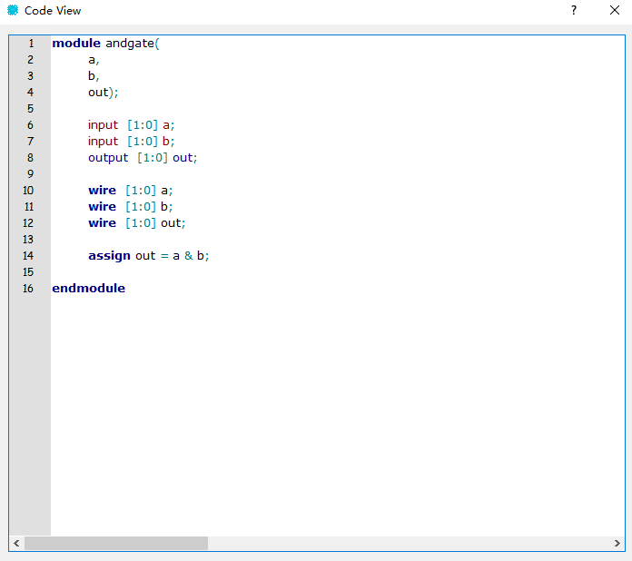
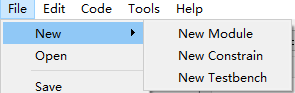

## 简介

此软件是用QT进行编写的一款可视化的用于FPGA设计的EDA软件。具备了传统FPGA EDA软件不具备的可视化设计功能，使开发工作变得更简单、直观。特点是可视化和代码相结合，灵活性高，自动生成代码等。


## 如何使用


如上图，整个软件分为：

1.菜单栏：包括文件的新建、打开、保存等操作。软件首选项设置。代码的生成、查看与导出等功能。

2.工作区：对模块、端口的操作以及核心算法的代码编写和整体代码的查看。

3.属性栏：当在工作区中选中端口或是模块后，右侧将会显示它们的属性，可以进行修改。

4.常用模块区：用户可将自己常用的模块保存至此，方便重复利用。

5.信息输出区：用来记录一些工作中的信息以及显示错误和警告。

## 示例

创建一个功能为两输入的与门，输入输出信号的数据长度均为2。

先在菜单栏的File->New->New Module中打开新建模块的对话框


在对话框中输入想创建的模块名、各端口数量。本例的模块名为andgate，输入端口数为2，输出端口数为1


点击OK后，工作区将会新建一个名为andgate的模块


其中左侧黄色的端口为输入端口，右侧灰色的端口为输出端口。首先先将默认的端口名p1、p2、p3分别改名为a、b、out。a和b端口为输入端口，out为输出端口。并将三个端口的数据长度都改成2位。


修改完如图：


其中，Name为端口属性，Inout为端口的输入输出类型，DataType为wire或reg型，DataSize为端口的数据长度，Function为用户给端口的功能备注。

将端口属性设置完毕后，在工作区的左下角的Code Eidtor中开始编写功能算法代码：

```verilog
assign out = a & b;
```


关闭代码编辑器后代码将会自动保存，此时可点击Code View查看生成的完整代码



最后在菜单栏中Code->CodeGenerate可以将verilog代码保存至.v文件


下方信息输出区也会有相应的提示


这是保存的.v文件，与Code View中的完整代码一致


模块文件的保存则是在菜单栏中File->Save中进行


保存的模块文件的文件名默认和模块的Name一致，后缀为.mod


也可选择Save As...来进行另存为

mod文件的打开在菜单栏的File->Open


选中.mod文件后即可在工作区内打开


下方的信息输出区也可导出为日志，在File->Export...->Log


Export->Project是将此模块相关的.v、.mod、.log文件导出至一个目录中。

## 其他功能说明以及待开发的内容

Edit->Clear Log可以将信息输出区清空


Tools->Preference->Language可以进行中英文切换


File->Add to Popular的作用是将当前模块添加到左侧常用区（正在开发）


File->New->New Constrain/Testbench是新建约束文件和新建测试文件（正在开发）



左侧常用区下面的Example是示例模块（还没做）


仿真功能（还没做）

多级模块以及例化（还没做）

……（还没做。。。）

## 文件目录

lang/目录:语言包


pics目录:图片

release目录:发布后的可执行文件。eda_qt_Vxx.exe为未打包的程序，不可单独使用。eda_qt_Vxx_boxed.exe为打包后的程序，可不放在目录中单独使用。注：如需要切换中英文，则lang目录必须存在。

src目录:代码文件，如下

ui文件：界面的设计


每个ui文件对应一个同名的.cpp和.h文件

about_dialog.ui:“关于”的界面

code_editor_dialog.ui:代码编辑、查看器的界面

mainwindow.ui:主界面

new_constrain:新建约束文件的界面

new_module:新建模块文件的界面

new_testbench:新建测试文件的界面

以下都为.cpp和.h文件

tabs:工作区的类

moduleqwidget:未使用

module:模块的类，模块相关的属性和方法

constrain:约束文件的类（待开发）

testbench:测试文件的类（待开发）

port:端口类，端口相关的属性和方法

Qsci目录：QScintilla是一个免费、跨平台、支持语法高亮的编辑控件。


Chinese/English.ts:QT语言家文件


